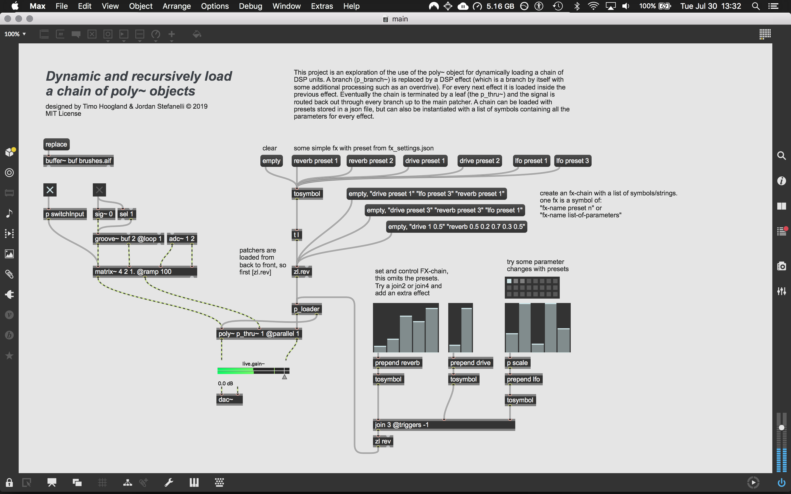
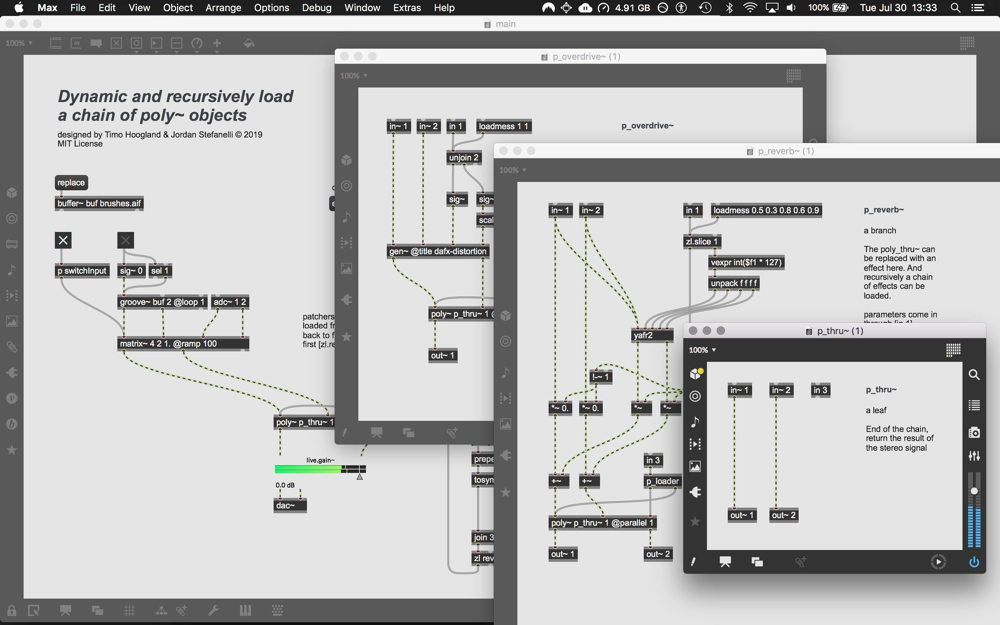

# poly-recursion

Dynamically build a chain of DSP with poly~ objects inside poly~ objects. This software is a work in progress. Feel free to clone/fork and use it in any way. Also feel free to get in touch with suggestions/ideas/bugs and anything else.

*Designed and Developed by Timo Hoogland & Jordan Stefanelli (c) 2019*

## About

This project is an exploration of the use of the poly~ object for dynamically loading a chain of DSP units. A branch (p_branch~) is replaced by a DSP effect (which is a branch by itself with some additional processing such as an overdrive). For every next effect it is loaded inside the previous effect. Eventually the chain is terminated by a leaf (the p_thru~) and the signal is routed back out through every branch up to the main patcher. A chain can be loaded with presets stored in a json file, but can also be instantiated with a list of symbols containing all the parameters for every effect.

- [Contains](#Contains)
- [Overview](#Overview)
- [Usage](#Usage)
- [Chain](#Chain)
- [Dependencies](#Dependencies)
- [Install](#Install)

## Contains

- **main** - *The top level node of the tree, inputting the signal, setting the fx-chain, adjusting parameters*

- **p_loader** - *Load the patcher in the poly~ object and apply the chosen preset or parameters.*

- **p_thru~** - *The leaf, a throughput of the input signal, returns the signal to the top level patcher*

- **p_branch~** - *An empty branch for poly~*

- **p_reverb~** - *A branch with the classic yafr2 reverb by Randy Jones*

- **p_overdrive~** - *A branch with an overdrive algorithm in gen~ ported from the DAFX book*

- **p_lfo~** - *A branch with an lfo effect*

- **fx_settings.json** - *A dictionary filled with some presets*

## Overview



## Usage
Open the project and start up the main.maxpat (should open automatically). 

### Presets

Provide a message with symbols for every effect you want to load. Append the message `preset n` for the preset you want to load in the poly~ object. `()` denote the start and end of a \[message] object.
```
("drive preset 2")
```
Provide a longer message with multiple symbols to create a chain of DSP.
```
("drive preset 1" "reverb preset 2" "lfo preset 1")
```
### Parameters
Provide all parameters in a message as one symbol to the \[p_loader] object

#### drive
```
("drive <amount >1 > <wet/dry 0-1>")
```
#### reverb
```
("reverb <wet/dry 0-1> <size 0-1> <decay 0-1> <damping 0-1> <diffusion 0-1>")
```
#### lfo
```
("lfo <wet/dry 0-1> <frequency> <depth 0-1> <shape 0,1,2,3> <pulse width 0-1>")
```

### Chain Overview


## Dependencies

- Max8
  - Tested and Developed in Max8
  - Possibily also working in Max7 and 6
- yafr2
  - reverb abstraction by Randy Jones (should be shipped with Max8)

## Install

Download zip
```
download and unzip project
```
Git clone
```
$ git clone https://github.com/tmhglnd/gl-pix-shaders.git
```

## License

This software is licensed under:

The MIT License
